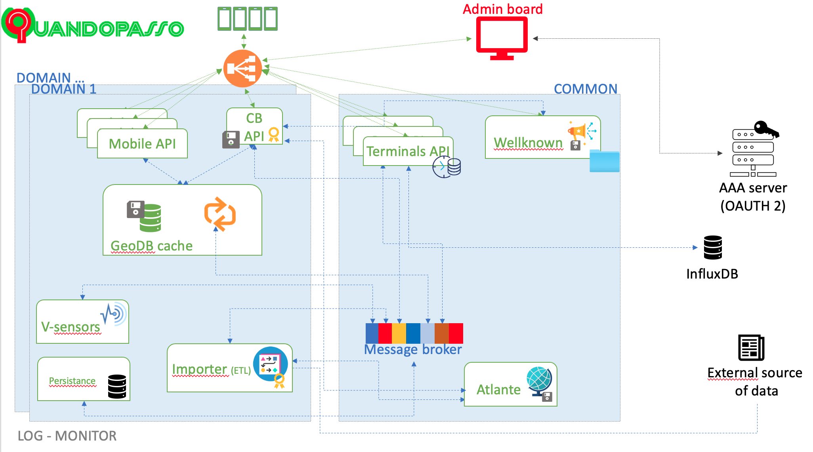
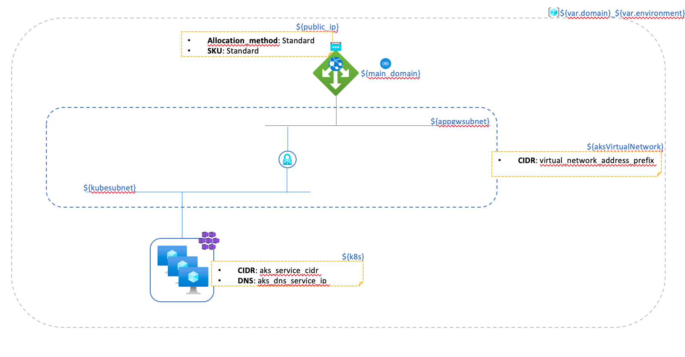
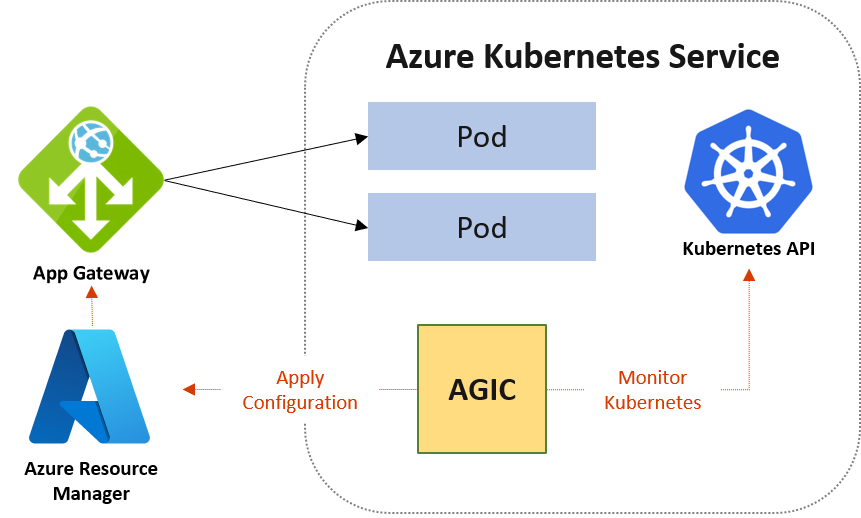

<!-- title: Quandopasso -->
[Home](../README.md)
# Quandopasso

Quandopasso™ is a new, innovative, patent pending OTT cloud system designed to provide prompt information about supervised road conditions to motorists.

The system allows road managers to visualize and quantify traveling users, and communicate with them directly, through the Quandopasso™ app downloaded on users’ smartphones.

The Quandopasso™ V2C (Vehicle to Cloud) system is designed to avoid any interaction between drivers and smartphones, therefore maximizing safety and law compliancy, since all messages are delivered through audio. This is what we mean by “Connected Driving”.

## Quandopasso cloud - Design principles

The Quandopasso™ cloud component is designed around the [microservices paradigm](https://en.wikipedia.org/wiki/Microservices), that is by dividing the service functionalities in single software entities, each responsible of a single and well defined goal.
This grants simpler and quicker development and deployment cycles, [horizontal scalability](https://en.wikipedia.org/wiki/Scalability#Horizontal_(scale_out)_and_vertical_scaling_(scale_up)) *by design* and a cloud-friendly architecture.

Each service is **disposable** by design(_The only exceptions to this principle are atlante and wellknown-api that needs to access a mounted volume in order to read informations they shuld provide_), that means that it keeps no state and can be destroyed and rebuilt without loosing information. 

All specific software is written using ``typescript`` and in particular the [``NestJS`` framework](https://nestjs.com/).

## Kubernetes

Services developed for quandopasso cloud architecture can virtually run on any platform with an updated nodejs valid installation. We use [kubernetes](https://kubernetes.io/) as underlying infrastructure system, so all scripts defined here are created for such platform. In particular we use an ``Azure Kubernetes Cluster`` leveraging as little as possible specific Azure solutions.

All Quandopasso services are installed in the Kubernetes cluster by means of helm charts, available [here](https://github.com/finvernizzi/charts/tree/terraform).

## Application Architecture

Following picture depicts the overall Quandopasso cloud architecture, as installed by this system.

It is worth noting that a single installation is capable of managing multiple customers defined by a dedicated ``domain``, as shown in the picture, with a set of services _common_ to all domain, and the remaining services dedicated to specific domain.

A message broker ([RabbitMQ](https://www.rabbitmq.com/)) is reponsible of inter-services communication and corehografy of correct operations.

## Network architecture

Following image depicts an high level view of the cloud network architecture implemented by these scripts for the Quandopasso Cloud solution.

Al external traffic, _in_ and _out_, is managed by an instance of an Azure Application Gateway, configured for HTTP redirecting to HTTPS, all relevant TLS certificates and HTTP routes.

The service network (_kubesubnet_) is connected to the Load balancer/AAG network (appgwsubnet).

## Application Gateway Ingress Controller

We implemented the [Application Geteway Ingress Controller pattern](https://azure.github.io/application-gateway-kubernetes-ingress/), meaning that all the HTTP routing is responsability of an Azure Application Gateway, that is controlled and configured by means of K8s Ingress rules. A specific AAG ingress controller operator is installed in the cluster with its set of dedicated CRD, and will manage AAG configurations in order to implement the ingress rules defined.

